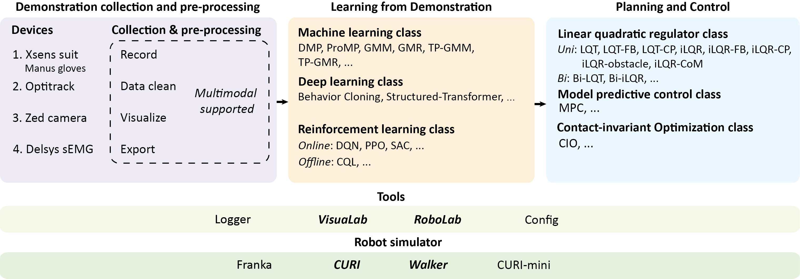

# Rofunc-ros: A Ros Package for Human-centered Interactive Intelligent Humanoid Robots

## Functions

### Chat

```
roslaunch wpr_chatgpt start.launch
```

```
rosrun wpr_chatgpt str_pub.py "Hello"
```

### Speech2text

English
```
roslaunch ros_vosk ros_vosk_en.launch
```
Chinese
```
roslaunch ros_vosk ros_vosk_cn.launch
```

### Text2speech


```
roslaunch tts sample_application.launch
```

```
rosrun tts voicer.py 'Hello everyone! I am CURI, a humanoid robot designed by \
      collaborative and versatile robots laboratory. Our lab focuses on the co-evolutionary\
      development of human-centered robotics and AI technologies for advanced robots, such as \
      human-like mobile manipulators, humanoid robots, to perform autonomous, assistive and \
      collaborative tasks by learning and transferring the skills from humans.'
```

## Cite

If you use rofunc-ros in a scientific publication, we would appreciate citations to the following paper:

```
@misc{Rofunc2022,
      author = {Liu, Junjia and Li, Zhihao and Li, Chenzui and Chen, Fei},
      title = {Rofunc: The full process python package for robot learning from demonstration},
      year = {2022},
      publisher = {GitHub},
      journal = {GitHub repository},
      howpublished = {\url{https://github.com/Skylark0924/Rofunc}},
}
```

## The Team
Rofunc-ros is developed and maintained by the [CLOVER Lab (Collaborative and Versatile Robots Laboratory)](https://feichenlab.com/), CUHK.


## Related repository: Rofunc

We also have a python package robot learning from demonstration and robot manipulation (**Rofunc**). 

> **Repository address: https://github.com/Skylark0924/Rofunc**

[](https://pypi.org/project/rofunc/)


[](https://github.com/Skylark0924/Rofunc/issues?q=is%3Aissue+is%3Aclosed)
[](https://github.com/Skylark0924/Rofunc/issues?q=is%3Aopen+is%3Aissue)
[](https://rofunc.readthedocs.io/en/latest/?badge=latest)
[](https://actions-badge.atrox.dev/Skylark0924/Rofunc/goto?ref=main)


