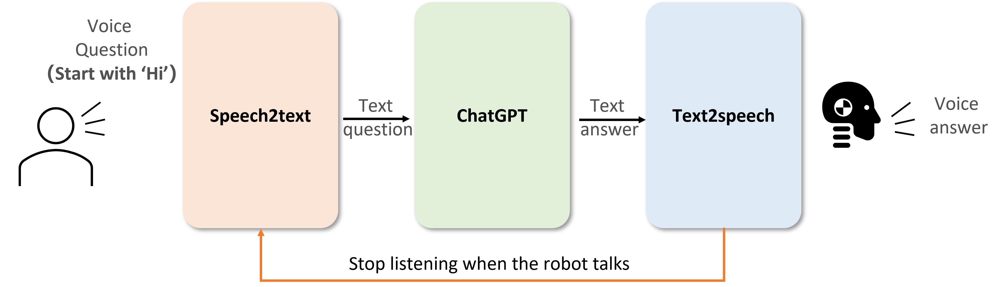

# Voice Q&A

- [Voice Q\&A](#voice-qa)
  - [Running in one command](#running-in-one-command)
  - [Running separatedly](#running-separatedly)
    - [Speech2text](#speech2text)
    - [Chat](#chat)
    - [Text2speech](#text2speech)


## Running in one command

For this function, we implemented a Voice Q&A robot based on `ChatGPT`. This function consists of `Speech2text`, `Chat` and `Text2speech`. 



This whole pipeline can be activated by calling

**English**

```
roslaunch rofunc_ros voice_qa_en.launch
```

**Chinese**

```
roslaunch rofunc_ros voice_qa_cn.launch
```

----

## Running separatedly 

Following these instructions, you can run these sub-functions separately.

### Speech2text

English
```
roslaunch rofunc_ros speech2text_en.launch
```

Chinese
```
roslaunch rofunc_ros speech2text_cn.launch
```

### Chat

Open a terminal to run the launch file
```
roslaunch rofunc_ros start.launch
```

Open another terminal to feed the question
```
rosrun rofunc_ros str_pub.py "Hello"
```
### Text2speech

Open a terminal to run the launch file
```
roslaunch rofunc_ros text2speech.launch
```
Open another terminal to give the text
```
rosrun rofunc_ros voicer.py 'Hello everyone! I am CURI, a humanoid robot designed by \
       collaborative and versatile robots laboratory. Our lab focuses on the co-evolutionary\
       development of human-centered robotics and AI technologies for advanced robots, such as \
       human-like mobile manipulators, humanoid robots, to perform autonomous, assistive and \
       collaborative tasks by learning and transferring the skills from humans.'
```
