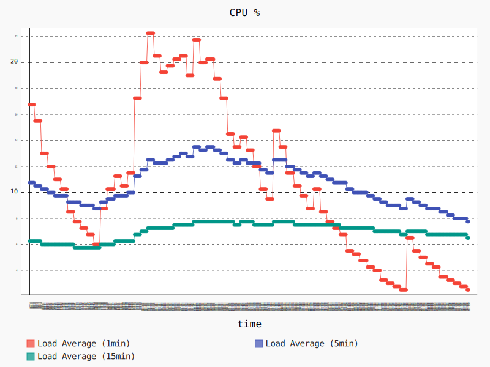
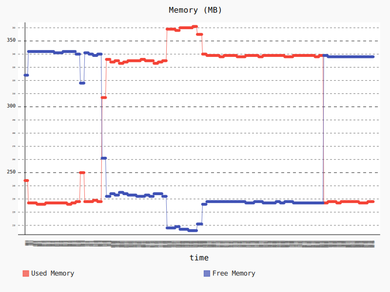

# tts


## Overview
The `tts` ROS node enables a robot to speak with a human voice by providing a Text-To-Speech service.
Out of the box this package listens to a speech topic, submits text to the Amazon Polly cloud service to generate an audio stream file,
retrieves the audio stream from Amazon Polly, and plays the audio stream via the default output device.
The nodes can be configured to use different voices as well as custom lexicons and SSML tags which enable you to control aspects of speech,
such as pronunciation, volume, pitch, speed rate, etc. A [sample ROS application] with this node,
and more details on speech customization are available within the [Amazon Polly documentation].

**Amazon Polly Summary**: Amazon Polly is a service that turns text into lifelike speech, allowing you to create applications that talk,
and build entirely new categories of speech-enabled products. Amazon Polly is a Text-to-Speech service that uses advanced deep learning technologies to synthesize speech that sounds like a human voice.
With dozens of lifelike voices across a variety of languages, you can select the ideal voice and build speech-enabled applications that work in many different countries.

### License
The source code is released under an [Apache 2.0].

**Author**: AWS RoboMaker<br/>
**Affiliation**: [Amazon Web Services (AWS)]<br/>
**Maintainer**: AWS RoboMaker, ros-contributions@amazon.com

### Supported ROS Distributions
- Kinetic
- Melodic

### Build status
* Travis CI:
    * "master" branch [](https://travis-ci.org/aws-robotics/tts-ros1/branches)
    * "release-latest" branch [](https://travis-ci.org/aws-robotics/tts-ros1/branches)
* ROS build farm:
    * ROS Kinetic @ u16.04 Xenial [](http://build.ros.org/job/Kbin_uX64__tts__ubuntu_xenial_amd64__binary)
    * ROS Melodic @ u18.04 Bionic [](http://build.ros.org/job/Mbin_uB64__tts__ubuntu_bionic_amd64__binary)


## Installation

### AWS Credentials
You will need to create an AWS Account and configure the credentials to be able to communicate with AWS services. You may find [AWS Configuration and Credential Files] helpful.

This node will require the following AWS account IAM role permissions:
- `polly:SynthesizeSpeech`

### Dependencies
In order to use the Text-To-Speech node with ROS kinetic you must update the version of boto3 that is installed on your system to at least version 1.9.0. You can do this by running the command:

        pip3 install -U boto3

This step is required before the node will work properly because the version of boto3 is not new enough for the features required by this node. 

### Binaries
On Ubuntu you can install the latest version of this package using the following command

        sudo apt-get update
        sudo apt-get install -y ros-$ROS_DISTRO-tts

### Building from Source

To build from source you'll need to create a new workspace, clone and checkout the latest release branch of this repository, install all the dependencies, and compile. If you need the latest development features you can clone from the `master` branch instead of the latest release branch. While we guarantee the release branches are stable, __the `master` should be considered to have an unstable build__ due to ongoing development. 

- Create a ROS workspace and a source directory

        mkdir -p ~/ros-workspace/src

- Clone the package into the source directory . 

        cd ~/ros-workspace/src
        git clone https://github.com/aws-robotics/tts-ros1.git -b release-latest

- Install dependencies

        cd ~/ros-workspace 
        sudo apt-get update && rosdep update
        rosdep install --from-paths src --ignore-src -r -y
        
_Note: If building the master branch instead of a release branch you may need to also checkout and build the master branches of the packages this package depends on._

- Build the packages

        cd ~/ros-workspace && colcon build

- Configure ROS library Path

        source ~/ros-workspace/install/setup.bash
        
- Build and run the unit tests

        colcon test --packages-select tts && colcon test-result --all

#### Test on Containers/Virtual Machines

Even if your container or virtual machine does not have audio device, you can still test TTS by leveraging an audio server.

The following is an example setup on a MacBook with PulseAudio as the audio server.
If you are new to PulseAudio, you may want to read the [PulseAudio Documentation].

**Step 1: Start PulseAudio on your laptop**

After installation, start the audio server with *module-native-protocol-tcp* loaded:

    pulseaudio --load=module-native-protocol-tcp --exit-idle-time=-1 --log-target=stderr -v

Note the extra arguments `-v` and `--log-target` are used for easier troubleshooting.

**Step 2: Run TTS nodes in container**

In your container, make sure you set the right environment variables.
For example, you can start the container using `docker run -it -e PULSE_SERVER=docker.for.mac.localhost ubuntu:16.04`.

Then you will be able to run ROS nodes in the container and hear the audio from your laptop speakers.

**Troubleshooting**

If your laptop has multiple audio output devices, make sure the right one has the right volume.
This command will give you a list of output devices and tell you which one has been selected:

    pacmd list-sinks | grep -E '(index:|name:|product.name)'

## Launch Files
An example launch file called `sample_application.launch` is provided.


## Usage

### Run the node
- **Plain text**
  - `roslaunch tts sample_application.launch`
  - `rosrun tts voicer.py 'Hello World'`

- **SSML**
  - `roslaunch tts sample_application.launch`
  - `rosrun tts voicer.py '<speak>Mary has a <amazon:effect name="whispered">little lamb.</amazon:effect></speak>' '{"text_type":"ssml"}'`


## Configuration File and Parameters
| Parameter Name | Type | Description |
| -------------- | ---- | ----------- |
| polly_action | *string* | Currently only one action named `SynthesizeSpeech` is supported. |
| text | *string* | The text to be synthesized. It can be plain text or SSML. See also `text_type`. |
| text_type | *string* | A user can choose from `text` and `ssml`. Default: `text`. |
| voice_id | *string* | The list of supported voices can be found on [official Amazon Polly document]. Default: Joanna |
| output_format | *string* | Valid formats are `ogg_vorbis`, `mp3` and `pcm`. Default: `ogg_vorbis` |
| output_path | *string* | The audio data will be saved as a local file for playback and reuse/inspection purposes. This parameter is to provide a preferred path to save the file. Default: `.` |
| sample_rate | *string* | Note `16000` is a valid sample rate for all supported formats. Default: `16000`. |


## Performance and Benchmark Results
We evaluated the performance of this node by runnning the followning scenario on a Raspberry Pi 3 Model B:
- Launch a baseline graph containing the talker and listener nodes from the [roscpp_tutorials package](https://wiki.ros.org/roscpp_tutorials), plus two additional nodes that collect CPU and memory usage statistics. Allow the nodes to run for 60 seconds. 
- Launch the nodes `polly_node`, `synthesizer_node` and `tts_node` by using the launch file `sample_application.launch` as described above. At the same time, perform several calls to the action `tts/action/Speech.action` using the `voicer.py` script descried above, by running the following script in the background:

```bash
rosrun tts voicer.py  '<speak>Amazon Polly is a <emphasis level="strong">Text-to-Speech</emphasis> (TTS) cloud service</speak>' '{"text_type":"ssml"}' ; sleep 1
rosrun tts voicer.py  '<speak>that converts text into lifelike speech</speak>' '{"text_type":"ssml"}' ; sleep 1
rosrun tts voicer.py  '<speak>You can use Amazon Polly to develop applications that increase <emphasis level="moderate">engagement and accessibility</emphasis></speak>' '{"text_type":"ssml"}' ; sleep 1
rosrun tts voicer.py  '<speak>Amazon Polly supports multiple languages and includes a variety of lifelike voices</speak>' '{"text_type":"ssml"}' ; sleep 1
rosrun tts voicer.py  '<speak>so you can build speech-enabled applications that work in multiple locations</speak>' '{"text_type":"ssml"}' ; sleep 1
rosrun tts voicer.py  '<speak>and use the ideal voice for your customers</speak>' '{"text_type":"ssml"}' ; sleep 1
```

- Allow the nodes to run for 180 seconds. 
- Terminate the  `polly_node`, `synthesizer_node` and `tts_node` nodes, and allow the reamaining nodes to run for 60 seconds.

The following graph shows the CPU usage during that scenario.  The 1 minute average CPU usage starts at 16.75% during the launch of the baseline graph, and stabilizes at 6%. When we launch the Polly nodes around second 85, the 1 minute average CPU increases up to a peak of 22.25% and stabilizes around 20%. After we stop making requests with the script `voicer.py` around second 206 the 1 minute average CPU usage moves to around 12%, and decreases gradually, and goes down again to 2.5 % after we stop the Polly nodes at the end of the scenario. 



The following graph shows the memory usage during that scenario. We start with a memory usage of around 227 MB that increases to around 335 MB (+47.58%) when we lanch the Polly nodes around second 85, and gets to a peak of 361 MB (+59% wrt. initial value) while we are calling the script `voicer.py`. The memory usage goes back to the initial values after stopping the Polly nodes. 




## Nodes

### polly
Polly node is the engine for the synthesizing job. It provides user-friendly yet powerful APIs so a user doesn't have to deal with technical details of AWS service calls.

#### Services
- **`polly (tts/Polly)`**

  Call the service to use Amazon Polly to synthesize the audio.

#### Reserved for future usage
- `language_code (string, default: None)`
  
  A user doesn't have to provide a language code and this is reserved for future usage.

- `lexicon_content (string, default: None)`

- `lexicon_name (string, default: None)`

- `lexicon_names (string[], default: empty)`

- `speech_mark_types (string[], default: empty)`

- `max_results (uint32, default: None)`

- `next_token (string, default: None)`

- `sns_topic_arn (string, default: None)`

- `task_id (string, default: None)`

- `task_status (string, default: iNone)`

- `output_s3_bucket_name (string, default: None)`

- `output_s3_key_prefix (string, default: None)`

- `include_additional_language_codes (bool, default: None)`

### synthesizer node

#### Services
- **`synthesizer (tts/Synthesizer)`**

  Call the service to synthesize.

#### Parameters

- **`text (string)`**

    The text to be synthesized.

- **`metadata (string, JSON format)`**

    Optional, for user to have control over how synthesis happens.

### tts node

#### Action

- **`speech`**

#### Parameters

- **`text (string)`**

  The text to be synthesized.

- **`metadata (string, JSON format)`**

  Optional, for user to have control over how synthesis happens.


## Bugs & Feature Requests
Please contact the team directly if you would like to request a feature.

Please report bugs in [Issue Tracker].


[AWS Configuration and Credential Files]: https://docs.aws.amazon.com/cli/latest/userguide/cli-config-files.html
[Amazon Polly documentation]: https://docs.aws.amazon.com/polly/latest/dg/what-is.html
[Amazon Web Services (AWS)]: https://aws.amazon.com/
[Apache 2.0]: https://aws.amazon.com/apache-2-0/
[Issue Tracker]: https://github.com/aws-robotics/tts-ros1/issues
[PulseAudio Documentation]: https://www.freedesktop.org/wiki/Software/PulseAudio/Documentation/
[official Amazon Polly document]: https://docs.aws.amazon.com/polly/latest/dg/voicelist.html
[sample ROS application]: https://github.com/aws-robotics/aws-robomaker-sample-application-voiceinteraction
